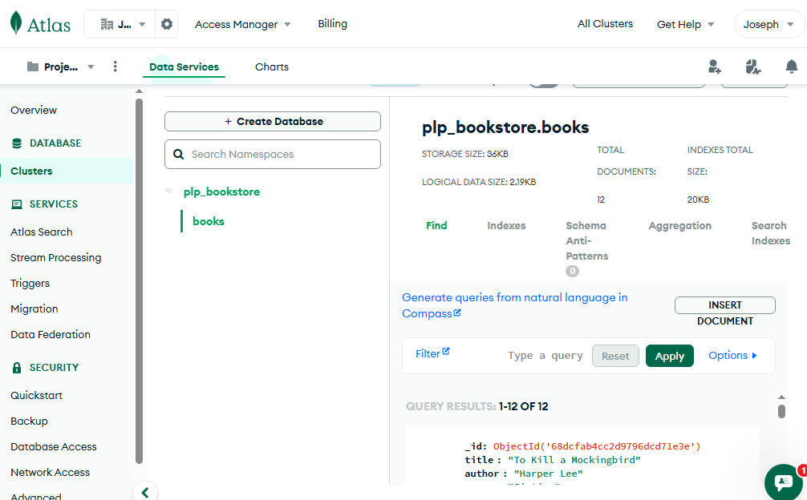

# 📚 PLP Bookstore – MongoDB Demo

This project demonstrates how to use **MongoDB** with Node.js to manage a simple bookstore collection.  
It includes sample data (`insert_books.js`) and example queries (CRUD, Aggregation, Indexing, and Pagination).

---

## 🚀 Prerequisites
Before getting started, make sure you have the following installed:

- [Node.js](https://nodejs.org/) (v18+ recommended)  
- [npm](https://www.npmjs.com/) (comes with Node.js)  
- [MongoDB Atlas](https://www.mongodb.com/cloud/atlas) account **OR** local MongoDB installation  
- [mongosh](https://www.mongodb.com/docs/mongodb-shell/) (MongoDB shell) for testing queries  

---

## ⚙️ Setup

1. **Clone this repository or copy the files to your machine.**

   ```bash
   git clone <repo-url>
   cd plp-bookstore


